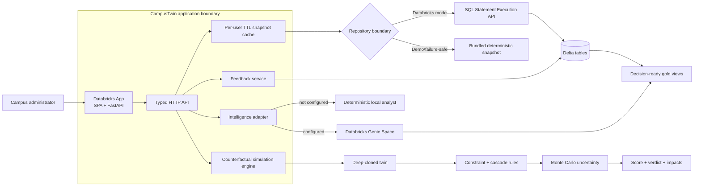

# CampusTwin

**A living campus decision-intelligence system built for Databricks Free Edition.**

CampusTwin turns fragmented academic, space, energy, transport, event, and resource data into one operational model. Administrators can inspect the present state, ask natural-language questions through Databricks Genie, clone the current twin into a counterfactual scenario, apply a proposed change, and compare its cascading effects before touching the real campus.

This repository is intentionally more than a dashboard. The design separates **facts**, **simulation**, **decision scoring**, **natural-language analysis**, and **real-world feedback** so each can evolve independently.

## What is runnable now

- A polished single-page CampusTwin application with no frontend build step.
- A dual-scale spatial twin: Three.js room and floor simulation plus a CesiumJS campus operations field.
- FastAPI backend with typed contracts and OpenAPI docs.
- Deterministic bundled campus dataset: 8 buildings, 58 rooms, 47 sections, 141 weekly sessions, 4 bus routes, 7 days of hourly building energy, events, and a walking graph.
- Delta-backed Databricks repository over the SQL Statement Execution API.
- One-click bootstrap from the app: schema, 9 canonical Delta tables, operational tables, 5 gold views, demo seed data.
- Databricks Genie Space provisioning through the official Genie API.
- What-if engine with room closure, class relocation, rescheduling, intake change, and bus service change actions.
- Cross-domain decision metrics, cascade explanations, score/verdict, and Monte Carlo confidence bands.
- Real-world feedback capture for predicted-vs-actual calibration.
- Per-user short-lived snapshot cache so Free Edition does not burn SQL calls unnecessarily and Unity Catalog user visibility is not mixed between users.
- Safe local/demo fallback: the entire product works before Databricks is initialized.
- Declarative Automation Bundle configuration for a Databricks App with only `sql` and `genie` user scopes.
- Automated tests and smoke checks.

## Architecture in one picture



Read [`docs/ARCHITECTURE.md`](docs/ARCHITECTURE.md) for the detailed reasoning and boundaries. The strict visual contract lives in [`DESIGN.md`](DESIGN.md). [`docs/SPATIAL_TWIN.md`](docs/SPATIAL_TWIN.md) records the 3D engine and geometry contracts. [`docs/TRACEABILITY.md`](docs/TRACEABILITY.md) maps the supplied brief to executable components. [`docs/ARCHITECTURE_DECISIONS.md`](docs/ARCHITECTURE_DECISIONS.md) records the major trade-offs.

## 1. Run locally in 60 seconds

Python 3.11+ is recommended.

```bash
python -m venv .venv
source .venv/bin/activate       # Windows: .venv\Scripts\activate
pip install -r requirements-dev.txt
./scripts/dev.sh
```

Open `http://127.0.0.1:8000`.

By default local development uses the bundled demo if no Databricks credentials are configured. To force it explicitly:

```bash
export CAMPUS_TWIN_DATA_MODE=demo
```

To force real Databricks locally, set the values from `.env.databricks.example` in your shell and use the Databricks launcher:

```powershell
$env:DATABRICKS_HOST = "https://<workspace-host>"
$env:DATABRICKS_TOKEN = "<local-development-token>"
$env:DATABRICKS_WAREHOUSE_ID = "<warehouse-id>"
$env:CAMPUS_TWIN_GENIE_PARENT_PATH = "/Workspace/Users/<your-email>"
.\scripts\dev-databricks.ps1
```

In forced Databricks mode, missing credentials or SQL errors are surfaced instead of falling back to bundled demo data.

Useful endpoints:

```text
GET  /api/health
GET  /api/twin/summary
GET  /api/twin/topology
GET  /api/twin/rooms
GET  /api/twin/schedule
POST /api/scenarios/simulate
POST /api/genie/chat
POST /api/admin/bootstrap
POST /api/feedback
GET  /api/docs
```

## 2. Deploy to Databricks Free Edition

### Prerequisites

1. A Databricks Free Edition workspace.
2. A SQL warehouse in that workspace.
3. A recent Databricks CLI authenticated to the workspace.
4. Your user must be able to create the configured schema/tables and use the warehouse.

Find the warehouse ID in the SQL warehouse page, then from this repository run:

```bash
databricks bundle validate --var warehouse_id=<YOUR_WAREHOUSE_ID>
databricks bundle deploy   --var warehouse_id=<YOUR_WAREHOUSE_ID>
databricks bundle run campus_twin --var warehouse_id=<YOUR_WAREHOUSE_ID>
```

`bundle deploy` uploads the source and updates the app resource. `bundle run campus_twin` starts/restarts the app with that deployment.

The bundle requests only these user-authorization scopes:

```yaml
user_api_scopes:
  - sql
  - genie
```

The SQL warehouse is bound to the app as resource key `sql-warehouse`; `app.yaml` resolves it into `DATABRICKS_WAREHOUSE_ID` using `valueFrom` rather than embedding a resource ID or secret in source.

### First app launch

Open the deployed app, choose **Databricks setup** in the lower-left, then choose **Initialize Databricks**.

The bootstrap performs, in order:

1. Create `workspace.campus_twin` if it does not exist.
2. Create the canonical Delta tables and operational tables.
3. Seed deterministic demo rows into empty canonical tables.
4. Create/update the five gold views.
5. Optionally create or update the **CampusTwin Operations Analyst** Genie Space and store its `space_id` in Delta `app_config`.
6. Clear the local snapshot cache so the next request switches from bundled demo to Delta-backed data.

The app uses the `x-forwarded-access-token` supplied by Databricks Apps for those user-triggered SQL and Genie calls. A personal access token is **not** embedded in the app.

See [`docs/DEPLOYMENT.md`](docs/DEPLOYMENT.md) for troubleshooting and local Databricks-connected development.

## 3. Use the digital twin

### Judge demo

Open the app and choose **Run Judge Demo** on the first screen. The flow asks Genie for the first operational investigation, runs a governed resilience scenario, persists the run when Databricks is active, and refreshes saved scenario comparison. It is designed as the reliable judging path: evidence first, scenario second, decision memory third.

### Overview

The first screen gives a compact operational state: campus health, timetable room utilization, capacity fit, modeled bus peak pressure, latest-day energy, topology, building pressure, route pressure, and upcoming events.

### Explore

Filter room inventory and the timetable. The UI deliberately calls out model semantics: scheduled utilization is not the same thing as live occupancy.

### Simulate

The simulation endpoint accepts up to eight actions in a scenario:

```json
{
  "name": "Peak transit relief",
  "objective": "transport",
  "persist": true,
  "actions": [
    {
      "type": "adjust_bus_frequency",
      "params": {"route_id": "R2", "headway_minutes": 15, "active_buses": 4}
    },
    {
      "type": "adjust_bus_frequency",
      "params": {"route_id": "R4", "headway_minutes": 18, "active_buses": 4}
    }
  ]
}
```

The engine deep-clones the snapshot and applies actions to the clone. It never mutates the current campus state. It then recomputes capacity, schedule, energy, and transport signals; explains secondary impacts; runs uncertainty sampling; and returns a decision score plus verdict.

See [`docs/DECISION_MODEL.md`](docs/DECISION_MODEL.md).

### Ask Genie

If the Genie Space has been provisioned, the app forwards the question to Genie and can return the natural-language answer, generated SQL, and query result. Without Genie, a deterministic local analyst answers supported operational questions so judges can still evaluate the product end-to-end.

### Feedback

After a real intervention, enter a predicted value and the observed value. The record is stored in the feedback table with relative error. This is the beginning of the loop:

**simulate → implement → observe → learn → improve**

## Data model

```text
Campus topology
  buildings ──< rooms
      │          │
      │          └──< schedules >── sections
      │
      ├──< energy
      ├──< events
      └── walk_edges >── buildings

Mobility
  bus_routes ──< bus_demand

Decision memory
  scenario_runs
  feedback
  app_config
  audit_events
```

Gold views:

- `gold_room_utilization`
- `gold_building_energy_daily`
- `gold_bus_pressure`
- `gold_schedule_pressure`
- `gold_campus_overview`

Full details: [`docs/DATA_MODEL.md`](docs/DATA_MODEL.md).

## Why the simulation layer is separate from Genie

Genie is excellent for asking **what is true in the governed data**. A digital-twin scenario asks a different question: **what might become true if we deliberately change the system?**

CampusTwin therefore does not ask an LLM to silently mutate facts or invent counterfactuals. Scenario actions are explicit typed operations implemented in code. The result can later be narrated by an AI layer, but the state transition and metrics stay deterministic and inspectable.

This division is one of the most important architectural choices in the repository.

## Free Edition strategy

The project is deliberately shaped around Free Edition constraints rather than pretending unlimited infrastructure exists:

- One application process serves both UI and API.
- No Redis, Kafka, Postgres, separate frontend host, or mandatory model-serving endpoint.
- A short per-user cache collapses repeated dashboard reads.
- The app queries compact canonical tables and gold views through one SQL warehouse.
- Simulation is in-process and bounded.
- Genie is optional at runtime; no availability dependency can brick the demo.
- No permanently running pipeline is required for the starter dataset.
- Demo data is bundled under 1 MB and reproducible from a fixed seed.

See [`docs/FREE_EDITION.md`](docs/FREE_EDITION.md).

## Repository layout

```text
campus-twin/
├── app/
│   ├── app.yaml                     # Databricks App runtime config
│   ├── requirements.txt             # Runtime-only Python dependencies
│   ├── data/campus_snapshot.json    # Deployment copy of deterministic demo data
│   ├── sql/                         # Deployment copy of DDL / gold views / demo queries
│   └── campus_twin/
│       ├── main.py                  # App composition + SPA hosting
│       ├── api/                     # Typed HTTP boundary / source resolution
│       ├── databricks/              # REST, SQL, Genie, bootstrap
│       ├── repositories/            # Demo + Databricks persistence adapters
│       ├── services/                # Metrics, simulation, intelligence
│       └── static/                  # Anti-slop no-build frontend
├── data/campus_snapshot.json        # Development/demo snapshot
├── sql/                             # Human-readable DDL / gold / demo queries
├── notebooks/01_validate_twin.py   # Databricks validation notebook source
├── genie/campus_twin_space.json    # Inspectable Genie serialized-space design
├── tests/                           # Unit + API + deployment contract tests
├── scripts/                         # Generate, develop, smoke, verify, design audit
├── docs/                            # Architecture, security, deployment, traceability
├── docs/source/                     # Original supplied CampusTwin brief
├── DESIGN.md                        # Visual system + anti-AI-slop contract
├── databricks.yml                   # Declarative Automation Bundle
└── pyproject.toml                   # Test/lint project configuration
```

## Verification

```bash
./scripts/verify.sh
./scripts/dev.sh
# in another shell
curl http://127.0.0.1:8000/api/health
curl http://127.0.0.1:8000/api/twin/summary
python scripts/judge_demo_smoke.py
```

`verify.sh` compiles the backend, runs the pytest suite, executes an in-process product smoke test, runs the deterministic anti-slop design audit, and checks frontend JavaScript syntax when Node is installed. See [`VERIFICATION.md`](VERIFICATION.md) for the exact verification boundary.

## Team

**Team Paanch Dost:** Tanmay Sachan, Utkarsh Maheshwari, Aditya Kumar Singh, Jawin Roys Fernandes, Saksham Pandey.

## License

MIT. See [`LICENSE`](LICENSE).
